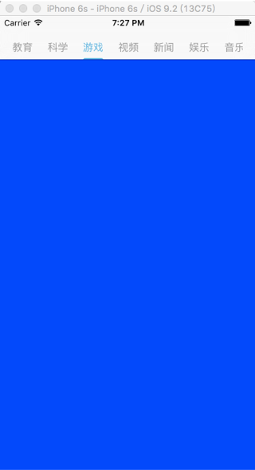

###QYSegementView使用
#####1.为视图控制器添加几个子视图控制器
        
	let v5 = O5ViewController()
	v5.title = "新闻"
    self.addChildViewController(v5)
	let v6 = O6ViewController()
	v6.title = "娱乐"
	self.addChildViewController(v6)
	let v7 = O7ViewController()
	v7.title = "音乐"
	self.addChildViewController(v7)
	let v8 = O8ViewController()
	v8.title = "电影"
	self.addChildViewController(v8)

2.实现QYSegementViewDelegate

	extension ViewController: QYSegementViewDelegate {
 		func numberOfSegement(segement: QYSegementView) 	-> Int {
       		return self.childViewControllers.count;
    	}
    	func QYSegementViewControllers(segement: 	QYSegementView, index: Int) -> UIViewController {
        	return self.childViewControllers[index]
    	}
	}
	
3.创建QYSegementView对象，可自定义title颜色属性

	let segement = QYSegementView(navigationBar: self.navigationController!.navigationBar, view: self.view, delegate: self)
	segement.titleNormalColor = UIColor(red: 155/255, green: 155/255, blue: 155/255, alpha: 1)
	segement.titleSelectedColor = UIColor(red: 74/255, green: 181/255, blue: 226/255, alpha: 1)
	segement.viewAdded()
	
4.如图

